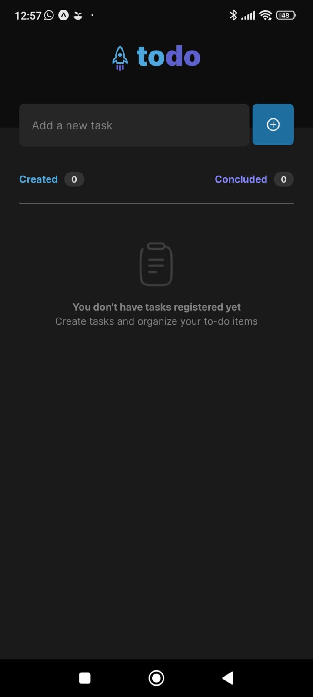

<div align="center" style="padding-bottom:30px; background:transparent">
  
  
</div>

## 💻 Project - To Do List

Todo-List is a challenge to practice fundamentals in React Native. Created by Rocketseat and made by me.

## 🚀 Technologies used

- [React Native](https://reactnative.dev/)
- [Typescript](https://www.typescriptlang.org)
- [Styled Components](https://styled-components.com/)
- [Eslint](https://eslint.org/)

### Getting Started

Clone the project repository

```
[https://github.com/LucasAnP/ToDoList.git](https://github.com/LucasAnP/ToDoList.git)
```

Access the project directory

```
cd ToDoList
```

Install the dependencies

```
yarn
  or
npm install
```

Start the APP

```
yarn android
  or
npx expo start

```

## 📄 License

MIT LICENSE
